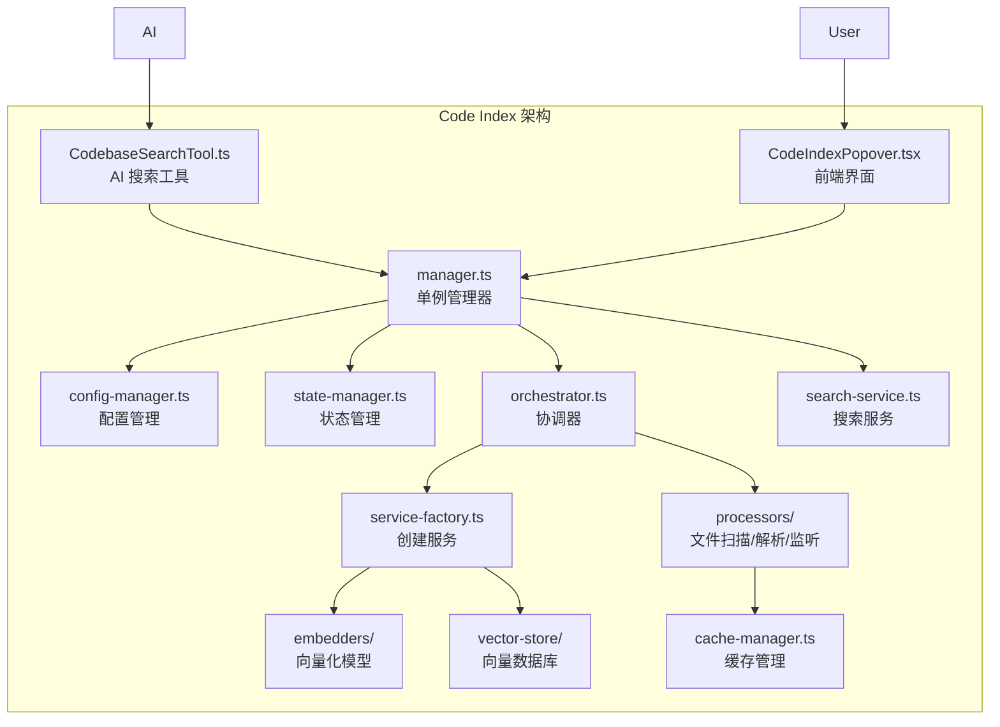

# 代码索引 (Code Index) 功能实现文件清单

## 核心管理类

| 文件 | 功能描述 |
|------|----------|
| [`src/services/code-index/manager.ts`](src/services/code-index/manager.ts) | **核心管理器**，单例模式，协调所有索引服务 |
| [`src/services/code-index/config-manager.ts`](src/services/code-index/config-manager.ts) | 配置管理，处理 API Key、提供商设置 |
| [`src/services/code-index/state-manager.ts`](src/services/code-index/state-manager.ts) | 索引状态管理（待机/处理中/完成/错误） |
| [`src/services/code-index/cache-manager.ts`](src/services/code-index/cache-manager.ts) | 缓存管理，存储已索引文件的哈希值 |

## 服务协调

| 文件 | 功能描述 |
|------|----------|
| [`src/services/code-index/orchestrator.ts`](src/services/code-index/orchestrator.ts) | **协调器**，管理索引工作流、增量扫描 |
| [`src/services/code-index/service-factory.ts`](src/services/code-index/service-factory.ts) | 服务工厂，创建 Embedder 和 VectorStore 实例 |
| [`src/services/code-index/search-service.ts`](src/services/code-index/search-service.ts) | 搜索服务，执行向量相似度查询 |

## 嵌入模型 (Embedders)

| 文件 | 提供商 |
|------|--------|
| [`src/services/code-index/embedders/openai.ts`](src/services/code-index/embedders/openai.ts) | OpenAI |
| [`src/services/code-index/embedders/ollama.ts`](src/services/code-index/embedders/ollama.ts) | Ollama 本地模型 |
| [`src/services/code-index/embedders/openrouter.ts`](src/services/code-index/embedders/openrouter.ts) | OpenRouter |
| [`src/services/code-index/embedders/gemini.ts`](src/services/code-index/embedders/gemini.ts) | Google Gemini |
| [`src/services/code-index/embedders/bedrock.ts`](src/services/code-index/embedders/bedrock.ts) | AWS Bedrock |
| [`src/services/code-index/embedders/mistral.ts`](src/services/code-index/embedders/mistral.ts) | Mistral AI |
| [`src/services/code-index/embedders/openai-compatible.ts`](src/services/code-index/embedders/openai-compatible.ts) | 兼容 OpenAI 的 API |
| [`src/services/code-index/embedders/vercel-ai-gateway.ts`](src/services/code-index/embedders/vercel-ai-gateway.ts) | Vercel AI Gateway |

## 文件处理

| 文件 | 功能描述 |
|------|----------|
| [`src/services/code-index/processors/scanner.ts`](src/services/code-index/processors/scanner.ts) | 文件扫描器，递归扫描代码文件 |
| [`src/services/code-index/processors/parser.ts`](src/services/code-index/processors/parser.ts) | 代码解析器，提取语义代码块 |
| [`src/services/code-index/processors/file-watcher.ts`](src/services/code-index/processors/file-watcher.ts) | 文件监听，实时增量更新索引 |

## 向量存储

| 文件 | 功能描述 |
|------|----------|
| [`src/services/code-index/vector-store/qdrant-client.ts`](src/services/code-index/vector-store/qdrant-client.ts) | Qdrant 向量数据库客户端 |

## 接口定义

| 文件 | 功能描述 |
|------|----------|
| [`src/services/code-index/interfaces/manager.ts`](src/services/code-index/interfaces/manager.ts) | 管理器接口定义 |
| [`src/services/code-index/interfaces/embedder.ts`](src/services/code-index/interfaces/embedder.ts) | Embedder 接口 |
| [`src/services/code-index/interfaces/vector-store.ts`](src/services/code-index/interfaces/vector-store.ts) | 向量存储接口 |
| [`src/services/code-index/interfaces/config.ts`](src/services/code-index/interfaces/config.ts) | 配置接口 |
| [`src/services/code-index/interfaces/file-processor.ts`](src/services/code-index/interfaces/file-processor.ts) | 文件处理器接口 |
| [`src/services/code-index/interfaces/index.ts`](src/services/code-index/interfaces/index.ts) | 接口统一导出 |

## 工具集成

| 文件 | 功能描述 |
|------|----------|
| [`src/core/tools/CodebaseSearchTool.ts`](src/core/tools/CodebaseSearchTool.ts) | AI 工具 `codebase_search` 的实现 |

## 前端界面

| 文件 | 功能描述 |
|------|----------|
| [`webview-ui/src/components/chat/CodeIndexPopover.tsx`](webview-ui/src/components/chat/CodeIndexPopover.tsx) | UI 组件：索引设置弹窗 |

## WebView 通信处理

| 文件 | 功能描述 |
|------|----------|
| [`src/core/webview/webviewMessageHandler.ts`](src/core/webview/webviewMessageHandler.ts) | 处理前端消息：保存设置、启动索引、查询状态等 |
| [`src/core/webview/ClineProvider.ts`](src/core/webview/ClineProvider.ts:75) | 提供 CodeIndexManager 实例给前端 |

## 扩展集成点

| 文件 | 功能描述 |
|------|----------|
| [`src/extension.ts`](src/extension.ts:32) | 扩展激活时初始化所有工作区的 CodeIndexManager |
| [`src/core/prompts/tools/filter-tools-for-mode.ts`](src/core/prompts/tools/filter-tools-for-mode.ts:6) | 根据索引状态控制 `codebase_search` 工具可用性 |
| [`src/core/prompts/system.ts`](src/core/prompts/system.ts:12) | 系统提示词中集成代码索引能力说明 |
| [`src/activate/registerCommands.ts`](src/activate/registerCommands.ts:13) | 注册索引相关命令 |

## 架构流程图

