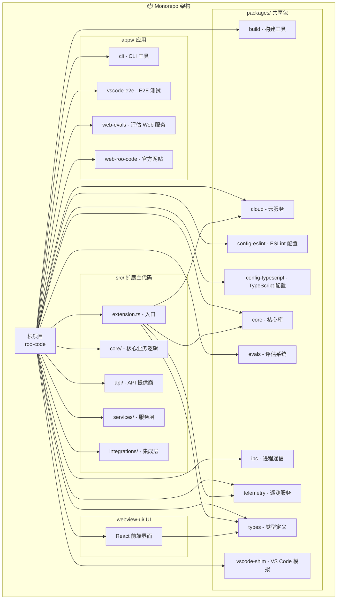
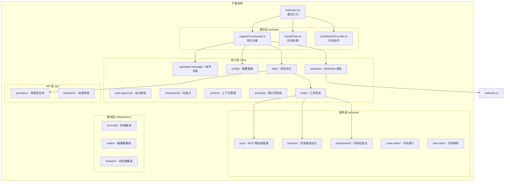
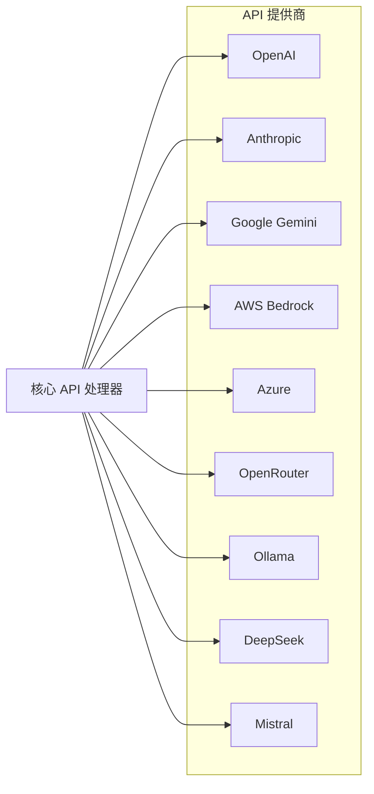
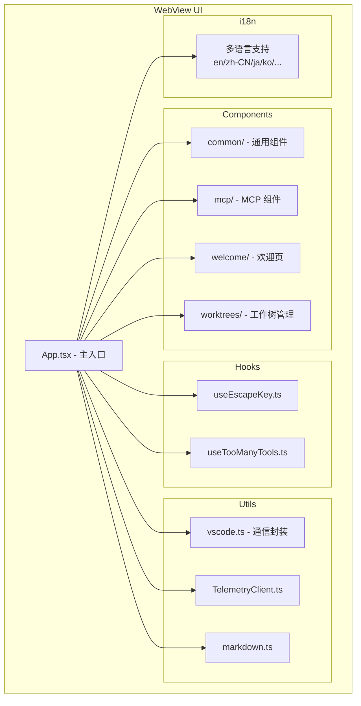
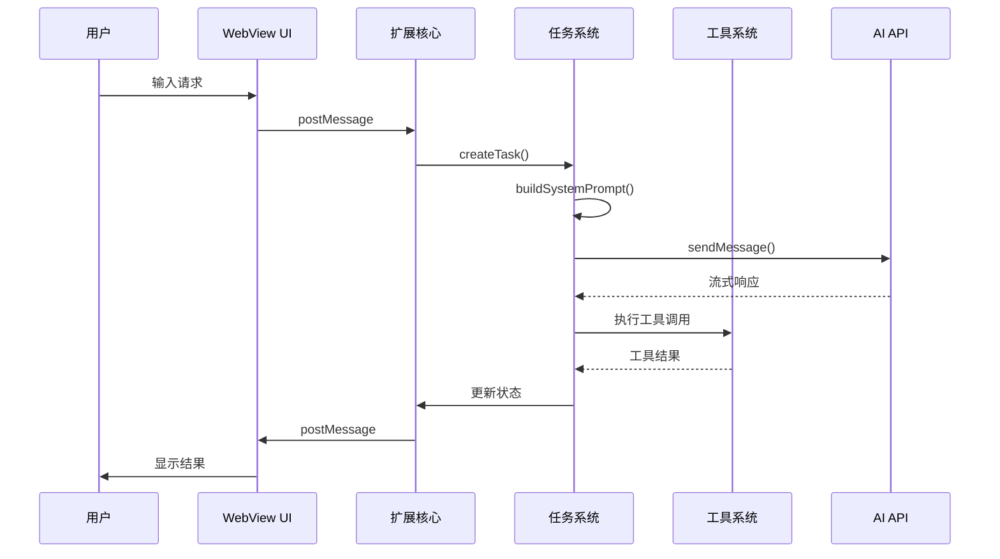

# Roo Code 项目架构与模块说明文档

## 项目概述

Roo Code 是一个 VS Code 扩展，为开发者提供 AI 驱动的开发团队功能。它基于 Monorepo 架构，使用 pnpm workspaces 和 Turbo 构建工具管理多个相互关联的包和应用。



---

## 1. 根项目 (Root)

### 技术栈
- **包管理器**: pnpm 10.8.1
- **构建工具**: Turbo 2.5.6
- **Node 版本**: 20.19.2
- **语言**: TypeScript 5.8.3

### 关键文件
| 文件 | 说明 |
|------|------|
| [`package.json`](package.json) | 根项目配置，定义 workspaces 和脚本 |
| [`turbo.json`](turbo.json) | Turbo 构建配置，定义任务依赖 |
| `tsconfig.json` | TypeScript 根配置 |

### 常用脚本
```bash
pnpm build       # 构建所有包
pnpm test        # 运行所有测试
pnpm lint        # 代码检查
pnpm evals       # 运行评估系统
```

---

## 2. 扩展主代码 (src/)

这是 VS Code 扩展的核心实现，采用分层架构设计：



### 2.1 激活层 (src/activate/)

| 文件 | 功能 |
|------|------|
| [`registerCommands.ts`](src/activate/registerCommands.ts) | 注册所有 VS Code 命令 |
| [`handleTask.ts`](src/activate/handleTask.ts) | 处理任务创建和管理 |
| [`CodeActionProvider.ts`](src/activate/CodeActionProvider.ts) | 提供代码修复建议 |

### 2.2 核心层 (src/core/)

#### 2.2.1 任务系统 (task/)
```
task/
├── Task.ts                 # 主任务类
├── build-tools.ts          # 工具构建
├── mergeConsecutiveApiMessages.ts  # 消息合并
└── __tests__/              # 测试用例
```

**核心功能**:
- 任务生命周期管理
- 工具调用执行
- 消息流处理
- 状态持久化

#### 2.2.2 工具系统 (tools/)
```
tools/
├── BaseTool.ts             # 工具基类
├── ReadFileTool.ts         # 读取文件
├── WriteToFileTool.ts      # 写入文件
├── ExecuteCommandTool.ts   # 执行命令
├── BrowserActionTool.ts    # 浏览器操作
├── NewTaskTool.ts          # 创建子任务
├── AttemptCompletionTool.ts # 完成任务
└── ... (共 20+ 个工具)
```

#### 2.2.3 提示词系统 (prompts/)
```
prompts/
├── system.ts               # 系统提示词生成
├── responses.ts            # 响应模板
├── sections/               # 提示词组件
│   ├── capabilities.ts     # 能力说明
│   ├── objective.ts        # 目标定义
│   ├── rules.ts            # 规则说明
│   └── tools/              # 工具说明
└── instructions/           # 指令模板
```

### 2.3 API 层 (src/api/)

支持多种 AI 提供商：



### 2.4 服务层 (src/services/)

| 模块 | 功能 |
|------|------|
| [`mcp/`](src/services/mcp/) | Model Context Protocol 服务器管理 |
| [`browser/`](src/services/browser/) | 浏览器自动化和截图 |
| [`checkpoints/`](src/services/checkpoints/) | 代码版本检查点 |
| [`code-index/`](src/services/code-index/) | 代码库索引和搜索 |
| [`tree-sitter/`](src/services/tree-sitter/) | 多语言代码解析 |

---

## 3. WebView UI (webview-ui/)

React 前端界面，与扩展通过 VS Code WebView API 通信：



### 关键技术
- **框架**: React + TypeScript
- **样式**: Tailwind CSS
- **构建**: Vite
- **UI 组件**: Radix UI + Shadcn/ui

---

## 4. 共享包 (packages/)

### 4.1 core - 核心库 ([`packages/core/`](packages/core/))

| 模块 | 功能 |
|------|------|
| `browser.ts` | 浏览器相关功能 |
| `cli.ts` | CLI 相关功能 |
| `custom-tools/` | 自定义工具注册和管理 |
| `debug-log/` | 调试日志系统 |
| `message-utils/` | 消息处理工具 |
| `worktree/` | Git 工作树管理 |

### 4.2 types - 类型定义 ([`packages/types/`](packages/types/))

定义所有共享 TypeScript 类型：
- API 配置类型
- 任务/消息类型
- MCP 相关类型
- 工具参数类型
- 遥测类型

### 4.3 cloud - 云服务 ([`packages/cloud/`](packages/cloud/))

提供云端功能支持：
- 用户认证
- 设置同步
- 遥测数据上报
- WebSocket 桥接

### 4.4 evals - 评估系统 ([`packages/evals/`](packages/evals/))

自动化评估框架，用于测试 AI 性能：
```
evals/
├── src/                    # 评估运行器
├── docker-compose.yml      # Docker 配置
├── Dockerfile.runner       # 运行器镜像
└── README.md              # 使用说明
```

### 4.5 telemetry - 遥测服务 ([`packages/telemetry/`](packages/telemetry/))

使用 PostHog 进行数据收集：
- 使用统计
- 错误报告
- 性能指标

### 4.6 vscode-shim - VS Code 模拟 ([`packages/vscode-shim/`](packages/vscode-shim/))

为测试和非 VS Code 环境提供 API 模拟：
- 文件系统 API
- 窗口 API
- 工作区 API
- 命令 API

---

## 5. 应用 (apps/)

### 5.1 CLI 工具 ([`apps/cli/`](apps/cli/))

命令行版本的 Roo Code，支持：
- 非交互式任务执行
- JSON 事件流
- 状态持久化

### 5.2 Web Evals ([`apps/web-evals/`](apps/web-evals/))

评估系统的 Web 界面：
- 评估运行管理
- 实时结果查看
- 模型比较

### 5.3 官方网站 ([`apps/web-roo-code/`](apps/web-roo-code/))

Next.js 构建的官方网站：
- 产品介绍
- 文档
- 评估结果展示

---

## 6. 数据流架构



---

## 7. 开发指南

### 7.1 添加新工具

1. 在 [`src/core/tools/`](src/core/tools/) 创建工具类
2. 继承 `BaseTool`
3. 实现 `execute()` 方法
4. 在 [`src/core/prompts/tools/`](src/core/prompts/tools/) 添加提示词说明

### 7.2 添加新 API 提供商

1. 在 [`src/api/providers/`](src/api/providers/) 创建处理器
2. 实现消息转换
3. 处理流式响应

### 7.3 添加新语言支持

1. 在 `locales/` 添加翻译文件
2. 在 `webview-ui/src/i18n/locales/` 添加前端翻译
3. 更新语言配置

---

## 8. 测试策略

| 类型 | 位置 | 工具 |
|------|------|------|
| 单元测试 | `__tests__/` 子目录 | Vitest |
| E2E 测试 | `apps/vscode-e2e/` | VS Code Test |
| 集成测试 | `*.integration.spec.ts` | Vitest |
| 评估测试 | `packages/evals/` | 自定义框架 |

---

## 总结

Roo Code 采用清晰的 Monorepo 架构，各模块职责分明：

- **src/**: VS Code 扩展核心逻辑
- **webview-ui/**: React 前端界面
- **packages/**: 可复用的共享包
- **apps/**: 独立的应用程序

这种架构支持：
- ✅ 代码复用
- ✅ 独立发布
- ✅ 并行开发
- ✅ 清晰的依赖关系
- ✅ 可扩展的 AI 提供商支持